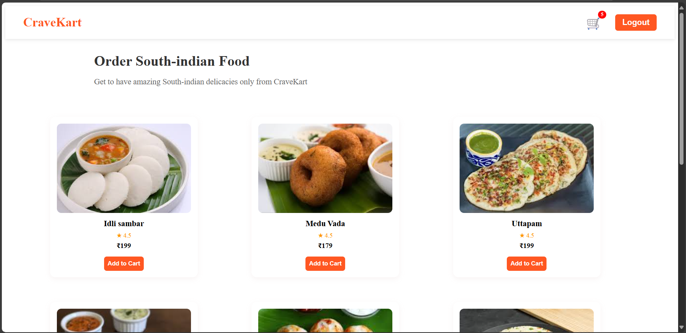
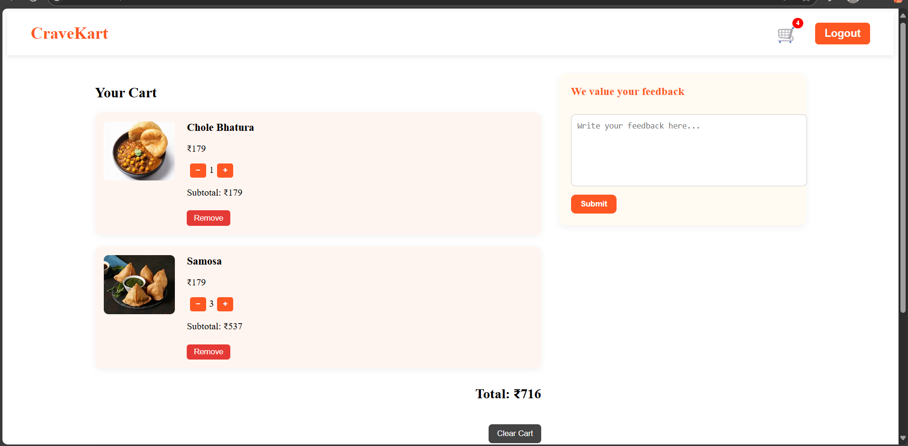
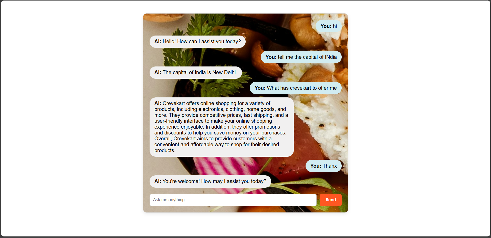
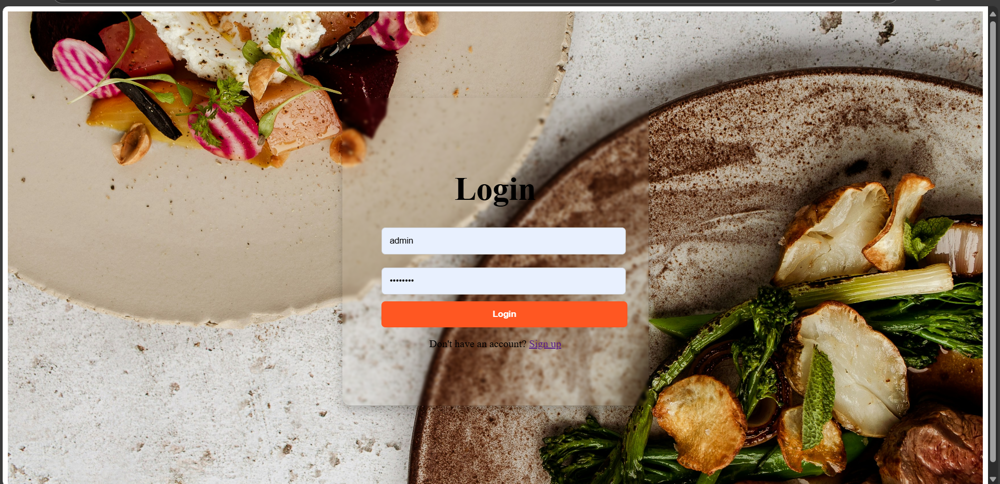
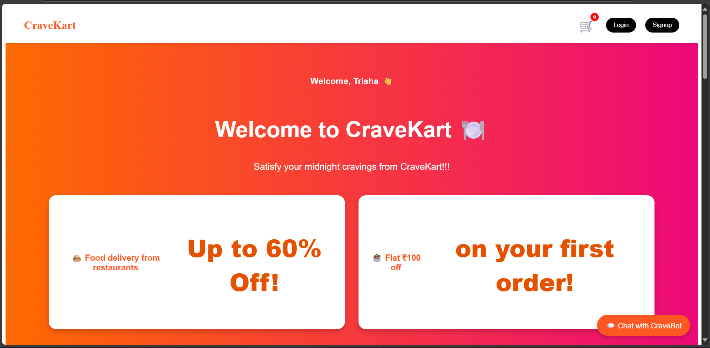
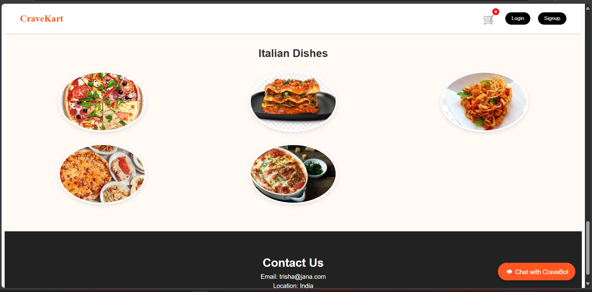

# 🛒 CraveKart - AI-Integrated Food Ordering Web App

CraveKart is a full-stack food ordering application built using **Angular 20** and **Node.js**, integrated with an **AI-powered chatbot** using **OpenRouter API** (free models). It simulates Swiggy-like behavior with category-based ordering, a persistent cart using localStorage, and smart user interaction via chat.

---

## 🚀 Features

### 🌐 Frontend (Angular)
- Home page with food category cards (Indian, Chinese, etc.)
- Login & Signup using Reactive Forms
- Product listing with dummy static data (images, names, prices)
- Add to Cart functionality
- Live cart count in navbar
- Cart page:
  - Quantity controls
  - Grand total calculation
  - Persists even after refresh/logout using `localStorage`

### 💬 AI Chatbot
- Chat interface built with Angular
- Messages sent to Node.js server
- Integrated with OpenRouter's free LLM (AI) models
- Works like a real assistant (tells jokes, answers questions)
- Background AI server running via Node.js
- Dummy fallback also supported if real AI quota ends

### 🔙 Backend (Node.js)
- Simple Express server
- CORS enabled
- `.env` support using `dotenv`
- AI API request made to OpenRouter with your API key
- Route: `POST /ask` receives message and sends AI reply

---

## 🧠 How localStorage is used
- When items are added to the cart, they are stored in `localStorage`
- On page load (even after refresh or logout-login), cart is restored
- Ensures data persistence without any database

---

## 🧪 Difficulties Faced
- Error `No endpoints found for model` — had to search for working free models like:
  - `openrouter/auto`
  - `gryphe/mythomist-7b`
- `429 Quota Exceeded` and fallback to dummy AI
- Angular standalone vs non-standalone component confusion

---

## 📁 Project Structure
```
CraveKart-app/
├── src/
│ └── app/
│ ├── pages/
│ │ ├── home/
│ │ ├── login/
│ │ ├── signup/
│ │ ├── cart/
│ │ ├── food-order/
│ │ └── chatbot/
│ └── services/
│ └── ai.ts
├── server.js
├── .env
└── README.md
```

## 🖼️ Screenshot







